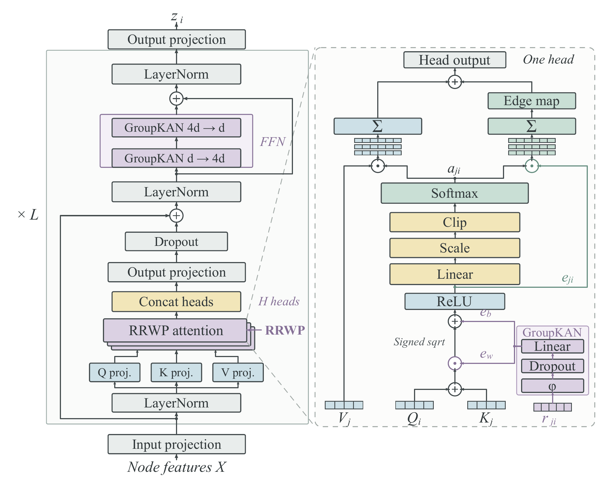

<a id="top"></a>

<div align="center">

<picture>
<source media="(max-width: 600px)" srcset="assets/readme/hero-mobile.svg">

</picture>

<p>
<a href="#overview"></a>
<a href="#method"></a>
<a href="#implementation"></a>
<a href="#citation"></a>
</p>

</div>

<a id="overview"></a>

<h2></h2>

**DRCIM-ML** is a diffusion-aware role-guided evolutionary approach to robust competitive influence maximization in multilayer networks. It selects seed sets that sustain influence under competing cascades and progressive structural damage.

A node can be central in one layer and peripheral in another. Transferring its identity therefore need not preserve its diffusion role. DRCIM-ML combines diffusion-aware representation learning with evolutionary multitasking to propose candidates by role and evaluate them under competition and node removal.

<p align="center"><a href="assets/figures/motivation.pdf"></a></p>

<a id="method"></a>

<h2></h2>

<p align="center"><a href="assets/figures/framework.pdf"></a></p>

**Diffusion-aware role learning.** The Diffusion-Aware Transformer (DAT) encodes graph structure using relative random-walk probabilities (RRWP). Reconstruction, attention-aware distribution alignment, and role constraints support layer-wise importance priors and cross-layer role similarity.

**Role-guided evolutionary search.** Related seed-selection tasks exchange candidates through a shared population. Importance priors guide sampling, while role correspondence guides cross-layer transfer. Population feedback updates the guidance, and a reinforcement-learning controller selects local-refinement actions.

**Robust evaluation.** Layer-wise competitive robustness, <i>R</i><sub>CS</sub>, and collaborative robustness, <i>R</i><sub>CR</sub>, are evaluated over successive node removals. Candidate quality depends on the complete seed pair and the damage trajectory.

<a id="dat-architecture"></a>

<h2></h2>

DAT provides the node representations used for role-guided search. The figure expands one attention block from the stacked encoder, showing how node features and pairwise RRWP representations enter the attention computation.

<p align="center"><a href="assets/figures/dat.pdf"></a></p>

<a id="implementation"></a>

<h2></h2>

The implementation combines representation pretraining with role-guided evolutionary search. Follow the [usage guide](docs/usage.md) to install the dependencies and prepare multilayer network data, then set the seed budgets, population size, and attack settings in [config.yaml](config.yaml).

Run both stages with

```bash
python -m code.run_gma_mfea --config config.yaml --mode all
```

Separate pretraining and search modes, checkpoint loading, and saved outputs are described in the guide.

<a id="citation"></a>

<h2></h2>

If this work supports your research, please consider citing the manuscript.

```bibtex
@unpublished{xu2026drcimml,
  title  = {Solving the Robust Influence Maximization Problem in Competitive
            Multilayer Networks via a Diffusion-Aware Role-Guided
            Evolutionary Approach},
  author = {Xu, Yongxue and Liu, Ziqian and Huang, Yongqing and Wang, Shuai},
  year   = {2026},
  note   = {Unpublished manuscript},
  url    = {https://github.com/IamJerryXu/DRCIM-ML}
}
```

---

<p align="center"><em>We welcome discussion and collaboration on network diffusion and evolutionary optimization.</em></p>

<p align="center"><a href="https://jerrysnow.me">Contact</a> · <a href="https://github.com/IamJerryXu/DRCIM-ML/issues">Questions and discussion</a></p>
