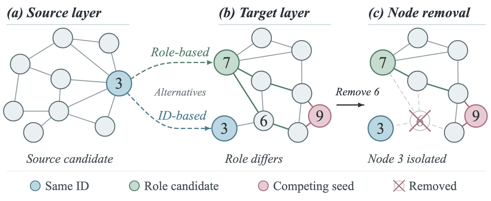
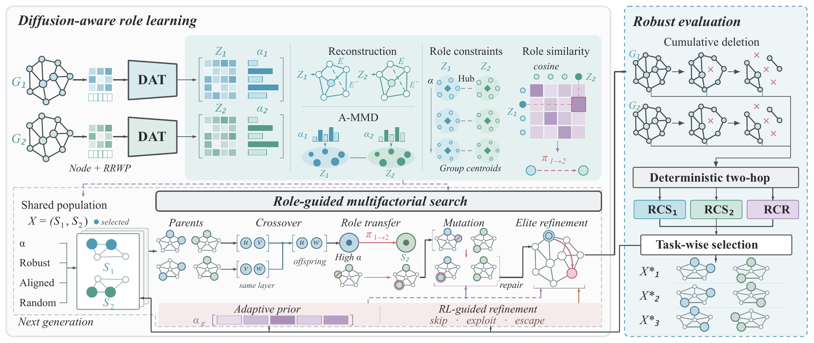
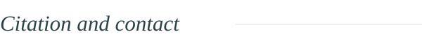

<a id="top"></a>

<div align="center">

<picture>
<source media="(max-width: 600px)" srcset="assets/readme/hero-mobile.svg">

</picture>

[Overview](#overview) &nbsp; · &nbsp; [Method](#method) &nbsp; · &nbsp; [Implementation](#implementation) &nbsp; · &nbsp; [Citation](#citation)

</div>

<a id="overview"></a>

<p></p>

**DRCIM-ML** studies robust competitive influence maximization in multilayer networks. The goal is to select seed sets that sustain influence in the presence of competing cascades and progressive structural damage.

A node can be central in one layer and peripheral in another. Transferring its identity therefore need not preserve its diffusion role. DRCIM-ML combines diffusion-aware representation learning with evolutionary multitasking to propose candidates by role and evaluate them under competition and node removal.

<p align="center"><a href="assets/figures/motivation.pdf"></a></p>

<p align="center"><sub>Cross-layer transfer proposals and an illustrative node removal. Role correspondence proposes a candidate; it does not establish robustness.</sub></p>

<a id="method"></a>

<p></p>

<p align="center"><a href="assets/figures/framework.pdf"></a></p>

**Diffusion-aware role learning.** A diffusion-aware Transformer uses relative random-walk probabilities to encode graph structure. Reconstruction, attention-aware distribution alignment, and role constraints support layer-wise importance priors and cross-layer role similarity.

**Role-guided evolutionary search.** Related seed-selection tasks exchange candidates through a shared population. Importance priors guide sampling, while role correspondence guides cross-layer transfer. Population feedback updates the guidance, and a reinforcement-learning controller selects local-refinement actions.

**Robust evaluation.** The manuscript evaluates layer-wise competitive robustness, <i>R</i><sub>CS</sub>, and collaborative robustness, <i>R</i><sub>CR</sub>, over successive node removals. Candidate quality depends on the complete seed pair and the damage trajectory.

<p align="center"><a href="assets/figures/framework.pdf">View the framework as PDF</a> &nbsp; · &nbsp; <a href="assets/figures/dat.pdf">View the DAT architecture</a></p>

<a id="implementation"></a>

<p></p>

The pipeline combines representation learning, cross-layer alignment, evolutionary seed search, and competitive influence evaluation. Configuration is provided in [config.yaml](config.yaml).

### Environment

```bash
git clone https://github.com/IamJerryXu/DRCIM-ML.git
cd DRCIM-ML

python -m venv .venv
source .venv/bin/activate
python -m pip install -r requirements.txt
python -m pip install node2vec
```

Two additional dependencies must be supplied before running the pipeline:

- **`torch-scatter`**, installed for the chosen PyTorch and CUDA versions. See the [PyG installation guide](https://pytorch-geometric.readthedocs.io/en/latest/install/installation.html).
- **`ikan.kat_1dgroup_torch.KAT_Group_Torch`**, imported by the encoder. This external module must be available in the Python environment; it is not bundled in the repository.

Set `project.device` in [config.yaml](config.yaml) to an available device. The checked-in value is `cuda:6`; change it to `cuda:0` or `cpu` as appropriate. The command-line interface has no `--device` option.

### Network input

Place network files in `dataset/train/`. Each text file contains layers marked by `layer:`, followed by undirected, unweighted edges. Use consistent node identifiers across layers and declare the node count in each layer header.

```text
layer:1 nodes=4 edges=3
0 1
1 2
2 3
layer:2 nodes=4 edges=3
0 2
0 3
1 3
```

The example above illustrates the file format. Prepare your network data before running the pipeline. The evolution entry point uses the first loaded network and its first two layers.

### Training and search

After preparing the data and dependencies, configure the seed budgets, population size, generation count, and attack settings in [config.yaml](config.yaml).

```bash
# Pretraining followed by evolutionary search
python -m code.run_gma_mfea --config config.yaml --mode all

# Pretraining only
python -m code.run_gma_mfea --config config.yaml --mode pretrain

# Evolution using previously generated alignment outputs
python -m code.run_gma_mfea --config config.yaml --mode evolution
```

<details>
<summary>Checkpoint loading and saved outputs</summary>

To load locally trained encoder weights:

```bash
python -m code.run_gma_mfea --config config.yaml \
  --mode load_checkpoint --checkpoint kaa_grit_v2
```

`kaa_grit_v2` is the configured filename prefix, not a downloadable checkpoint. The corresponding files must already exist in `checkpoints/`.

- `checkpoints/<prefix>_encoder_a.pt` and `_encoder_b.pt` store the encoder weights.
- `data/alignment/similarity_matrix/S_align.npy` stores cross-layer similarity.
- `data/alignment/` also contains layer embeddings and `alpha_l1.npy` / `alpha_l2.npy`.
- `results/best_t1_<timestamp>.json`, `best_t3_<timestamp>.json`, and `history_<timestamp>.json` store the exported search results and history. There is no separate T2 best-seed export in this entry point.

</details>

### Code guide

| Component | Source |
| :--- | :--- |
| Pipeline and command-line modes | [code/run_gma_mfea.py](code/run_gma_mfea.py) |
| Representation learning and alignment | [code/gma_core/](code/gma_core/) |
| Evolutionary search and local refinement | [code/mfea_core/](code/mfea_core/) |
| Competitive influence evaluation | [code/evaluation/](code/evaluation/) |
| Network loading and preprocessing | [code/utils/data_loader.py](code/utils/data_loader.py), [code/dataset/](code/dataset/) |
| Synthetic network generation | [network_generation/](network_generation/) |

<a id="citation"></a>

<p></p>

If this work supports your research, please consider citing the manuscript.

```bibtex
@unpublished{xu2026drcimml,
  title  = {Solving the Robust Influence Maximization Problem in Competitive
            Multilayer Networks via a Diffusion-Aware Role-Guided
            Evolutionary Approach},
  author = {Xu, Yongxue and Liu, Ziqian and Huang, Yongqing and Wang, Shuai},
  year   = {2026},
  note   = {Unpublished manuscript},
  url    = {https://github.com/IamJerryXu/DRCIM-ML}
}
```

For questions about the implementation, please [open an issue](https://github.com/IamJerryXu/DRCIM-ML/issues). Research enquiries can be directed through [Yongxue Xu's homepage](https://jerrysnow.me).

<details>
<summary>Use and permissions</summary>

The project is shared for academic research. No repository-wide license has been specified; public access alone does not grant unrestricted reuse or redistribution. Contact the maintainers for permissions. Dependencies remain subject to their respective licenses.

</details>

<p align="center"></p>

<p align="center"><a href="#top">Back to top</a></p>
